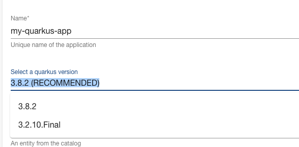

# Getting Started with Create React App

This project was bootstrapped with [Create React App](https://github.com/facebook/create-react-app).

## Available Scripts

In the project directory, you can run:

### `npm start`

Runs the app in the development mode.\
Open [http://localhost:3000](http://localhost:3000) to view it in your browser.

The page will reload when you make changes.\
You may also see any lint errors in the console.

### `npm test`

Launches the test runner in the interactive watch mode.\
See the section about [running tests](https://facebook.github.io/create-react-app/docs/running-tests) for more information.

### `npm run build`

Builds the app for production to the `build` folder.\
It correctly bundles React in production mode and optimizes the build for the best performance.

The build is minified and the filenames include the hashes.\
Your app is ready to be deployed!

See the section about [deployment](https://facebook.github.io/create-react-app/docs/deployment) for more information.

### `npm run eject`

**Note: this is a one-way operation. Once you `eject`, you can't go back!**

If you aren't satisfied with the build tool and configuration choices, you can `eject` at any time. This command will remove the single build dependency from your project.

Instead, it will copy all the configuration files and the transitive dependencies (webpack, Babel, ESLint, etc) right into your project so you have full control over them. All of the commands except `eject` will still work, but they will point to the copied scripts so you can tweak them. At this point you're on your own.

You don't have to ever use `eject`. The curated feature set is suitable for small and middle deployments, and you shouldn't feel obligated to use this feature. However we understand that this tool wouldn't be useful if you couldn't customize it when you are ready for it.

## Learn More

You can learn more in the [Create React App documentation](https://facebook.github.io/create-react-app/docs/getting-started).

To learn React, check out the [React documentation](https://reactjs.org/).

### Code Splitting

This section has moved here: [https://facebook.github.io/create-react-app/docs/code-splitting](https://facebook.github.io/create-react-app/docs/code-splitting)

### Analyzing the Bundle Size

This section has moved here: [https://facebook.github.io/create-react-app/docs/analyzing-the-bundle-size](https://facebook.github.io/create-react-app/docs/analyzing-the-bundle-size)

### Making a Progressive Web App

This section has moved here: [https://facebook.github.io/create-react-app/docs/making-a-progressive-web-app](https://facebook.github.io/create-react-app/docs/making-a-progressive-web-app)

### Advanced Configuration

This section has moved here: [https://facebook.github.io/create-react-app/docs/advanced-configuration](https://facebook.github.io/create-react-app/docs/advanced-configuration)

### Deployment

This section has moved here: [https://facebook.github.io/create-react-app/docs/deployment](https://facebook.github.io/create-react-app/docs/deployment)

### `npm run build` fails to minify

This section has moved here: [https://facebook.github.io/create-react-app/docs/troubleshooting#npm-run-build-fails-to-minify](https://facebook.github.io/create-react-app/docs/troubleshooting#npm-run-build-fails-to-minify)


## Quarkus Frontend

This plugin proposes different UI fields to:

| Name                                                        | Description                                                                                                                     |
|-------------------------------------------------------------|---------------------------------------------------------------------------------------------------------------------------------|
| [QuarkusExtensionList](#Quarkus-extensions-field)           | Filter, select your Quarkus extensions using the `Quarkus Extension List` field.                                                |
| [QuarkusQuickstartPicker](#Quarkus-Quickstart-picker-field) | Select using the `Quarkus QuickStart Picker` one of the quickstarts available: https://github.com/quarkusio/quarkus-quickstarts |
| [QuarkusVersionList](#Quarkus-version-list-field)           | List the recommended and available versions of Quarkus                                                                          |


**NOTE**: Such frontend feature(s) should be used with the quarkus scaffolder backend plugin (described hereafter) in order to get the generated project from https://code.quarkus.io/ as zip file !

### Quarkus UI fields

To use the frontend components, import the needed package under the following path within an existing backstage application:
```
cd packages/app
yarn add "@qshift/plugin-quarkus"
```

Next, customize the `packages/app/src/App.tsx` file according to the field that you plan to use

#### Quarkus extensions field

This field allows a user to pick up Quarkus extension(s) from the code generator server.

Edit the `packages/app/src/App.tsx` file to add the tag of the `<QuarkusExtensionListField />`
within the tag `<Route path="/create" element={<ScaffolderPage />}>` as described hereafter.

```tsx
...
import { ScaffolderFieldExtensions } from '@backstage/plugin-scaffolder-react';
import { QuarkusExtensionListField } from '@qshift/plugin-quarkus';
...
    <Route path="/create" element={<ScaffolderPage />}>
      <ScaffolderFieldExtensions>
        <QuarkusExtensionListField />
      </ScaffolderFieldExtensions>
...
```

Update your template file to use extension field:
```yaml
apiVersion: scaffolder.backstage.io/v1beta3
kind: Template
metadata:
  name: quarkus-application
  title: Create a Quarkus Application
  description: Create a Quarkus application using code generator "code.quarkus.io"
  tags:
    - quarkus
    - java
spec:
  owner: guests
  type: service

  parameters:
  ...
  - title: Customize the Quarkus application features
    properties:
      extensions:
        title: Quarkus Extensions
        type: array
        description: The list of the quarkus extensions
        ui:field: QuarkusExtensionList
  steps:
  ...
```

When done, you will be able to select your extension(s) when you scaffold a new project.

It is also possible to filter the extensions (aka restrict the list of the extensions to be used):
```yaml
    ui:field: QuarkusExtensionList
    ui:options:
      filter:
        extensions:
          - io.quarkus:quarkus-resteasy-reactive-jackson
          - io.quarkus:quarkus-smallrye-openapi
          - io.quarkus:quarkus-smallrye-graphql
          - io.quarkus:quarkus-hibernate-orm-rest-data-panache
```
If you would like to use a different code generator server, set the following property
```yaml
    ui:field: QuarkusExtensionList
    ui:options:
        codeQuarkusUrl: https://staging.code.quarkus.io
```

Quarkus Extension List - default (field):


Quarkus Extension List - Select (field):


Quarkus Extension List - Added (field):


#### Quarkus Quickstart picker field

This field allows a user to pick up a Quarkus Quickstart project.

Edit the `packages/app/src/App.tsx` file to add the tag of the `<QuarkusQuickstartPickerField />`
within the `<Route path="/create" element={<ScaffolderPage />}>` as described hereafter.

```tsx
...
import { ScaffolderFieldExtensions } from '@backstage/plugin-scaffolder-react';
import { QuarkusQuickstartPickerField } from '@qshift/plugin-quarkus';
...
    <Route path="/create" element={<ScaffolderPage />}>
      <ScaffolderFieldExtensions>
        <QuarkusQuickstartPickerField />
      </ScaffolderFieldExtensions>
...
```

Update your template file to use extension field:
```yaml
apiVersion: scaffolder.backstage.io/v1beta3
kind: Template
metadata:
  name: quarkus-quickstart
  title: Create a Quarkus Application from a Quickstart
  description: Create a Quarkus Application from one of the Quickstarts you can find on "https://github.com/quarkusio/quarkus-quickstarts"
  tags:
    - quarkus
    - java
spec:
  owner: guests
  type: service

  parameters:
  ...
  - title: Select the Quarkus Quickstart
    properties:
      quickstartName:
        title: Quickstart Name
        type: string
        description: The name of the quickstart to clone
        default: 'hibernate-orm-panache'
        ui:field: QuarkusQuickstartPicker
  steps:
  ...
```

When done, you will be able to create a new Quarkus project from the quickstart selected.

Quarkus Quickstart Picker - default (field):


Quarkus Quickstart Picker - select (field):


#### Quarkus Version list field

This field allows a user to select a Quarkus version from the list of the recommended and available version.

Edit the `packages/app/src/App.tsx` file to add the tag of the `<QuarkusQuickstartPickerField />`
within the `<Route path="/create" element={<ScaffolderPage />}>` as described hereafter.

```tsx
...
import { ScaffolderFieldExtensions } from '@backstage/plugin-scaffolder-react';
import { QuarkusVersionListField } from '@qshift/plugin-quarkus';
...
    <Route path="/create" element={<ScaffolderPage />}>
      <ScaffolderFieldExtensions>
        <QuarkusQuickstartPickerField />
      </ScaffolderFieldExtensions>
...
```
Update your template file to use extension field:
```yaml
apiVersion: scaffolder.backstage.io/v1beta3
kind: Template
metadata:
  name: quarkus-application
  title: Create a Quarkus Application
  description: Create a Quarkus application using code generator "code.quarkus.io"
  tags:
    - quarkus
    - java
spec:
  owner: guests
  type: service

  parameters:
  ...
  - title: Customize the Quarkus application features
    properties:
      quarkusVersion:
      title: Quarkus version
      type: array
      description: The list of the quarkus supported/recommended
      ui:field: QuarkusVersionList
      
  steps:
  ...
```

When done, you will be able to select the quarkus version to be used to scaffold 
your quarkus project

Quarkus Version list - Select (field):


Quarkus Version list - Recommended (field):

## Quarkus Scaffolder Backend

This plugin proposes 2 actions able to:

- Clone a Quarkus "Quickstart" repository. Action: `quarkus:quickstart:clone`
- Create a Quarkus using the website `code.quarkus.io` able to generate a zip file of a Quarkus project and extensions selected (using extension list field). Action: `quarkus:app:create`

To use the scaffolder backend, import the package under the following path:
```bash
cd packages/backend
yarn add "@qshift/plugin-quarkus-backend"
yarn add "@backstage/integration"
```

### quickstart:clone action

To use the Quarkus action able to clone a quarkus quickstart from this [repository](https://github.com/quarkusio/quarkus-quickstarts), then edit the file `packages/backend/src/plugins/scaffolder.ts` to register the action: `cloneQuarkusQuickstart`.

Here is a snippet example of code changed
```typescript
import { ScmIntegrations } from '@backstage/integration';
import {createBuiltinActions, createRouter} from '@backstage/plugin-scaffolder-backend';
import { cloneQuarkusQuickstart } from '@internal/plugin-quarkus-backend';
...
  const integrations = ScmIntegrations.fromConfig(env.config);

  const builtInActions = createBuiltinActions({
    integrations,
    catalogClient,
    config: env.config,
    reader: env.reader,
  });

  const actions = [...builtInActions, cloneQuarkusQuickstart()];

  return await createRouter({
    actions,
```

The following table details the fields that you can use to use this action:

| Input               | Description                                   | Type          | Required |
|---------------------|-----------------------------------------------|---------------|----------|
| quickstartName      | The name of the quickstart project to be used | string        | Yes      |
| groupId             | Maven GroupID                                     | No    |
| artifactId          | Maven ArtifactID                                  | No    |
| targetPath          | Target Path to access the code within the workspace | No    |
| additionalProperties | Quarkus properties                                | No    |
| database            | Quarkus backend database (PostgreSQL, etc)        | No    |
| infoEndpoint        | Quarkus API endpoint                              | No    |
| healthEndpoint      | Kubernetes Health ednpoint                        | No    |
| metricsEndpoint     | Enpoint exposing the Quarkus metrics              | No    |

Example of action:
```yaml
  steps:
    - id: template
      name: Generating the Source Code Component
      action: quarkus:quickstart:clone
      input:
        values:
          groupId: ${{ parameters.groupId }}
          artifactId: ${{ parameters.artifactId }}
          version: ${{ parameters.version }}
          quickstartName: ${{ parameters.quickstartName }}
          additionalProperties: ${{ parameters.additionalProperties }}
```

### app:create action

To use the Quarkus action able to create a quarkus application using `code.quarkus.io`, then edit the file `packages/backend/src/plugins/scaffolder.ts` to register the action: `createQuarkusApp`.

Here is a snippet example of code changed
```typescript
import { ScmIntegrations } from '@backstage/integration';
import {createBuiltinActions, createRouter} from '@backstage/plugin-scaffolder-backend';
import { createQuarkusApp } from '@internal/plugin-quarkus-backend';
...
  const integrations = ScmIntegrations.fromConfig(env.config);

  const builtInActions = createBuiltinActions({
    integrations,
    catalogClient,
    config: env.config,
    reader: env.reader,
  });

  const actions = [...builtInActions, createQuarkusApp()];

  return await createRouter({
    actions,
```
The following table details the fields that you can use to use this action:

| Input                | Description                                                      | Type    | Required |
|----------------------|------------------------------------------------------------------|---------|----------|
| quarkusVersion       | Quarkus version                                                  | string  | No       |
| groupId              | Maven GroupID                                                    | string  | No       |
| artifactId           | Maven ArtifactID                                                 | string  | No       |
| version              | Maven Version                                                    | string  | No       |
| buildTool            | Tool to be used to build: 'MAVEN', 'GRADLE', 'GRADLE_KOTLIN_DSL' | string  | No       |
| extensions           | List of the Quarkus extensions                                   | array   | No       |
| javaVersion          | JDK version                                                      | string  | No       |
| starterCode          | Generate for the project some code to start ?                    | boolean | No       |
| targetPath           | Target Path to access the code within the workspace              | string  | No       |
| additionalProperties | Quarkus properties                                               | string  | No       |
| database             | Quarkus backend database (PostgreSQL, etc)                       | string  | No       |
| infoEndpoint         | Has a Quarkus API endpoint ?                                     | boolean | No       |
| healthEndpoint       | Has a Kubernetes Health endpoint ?                               | boolean | No       |
| metricsEndpoint      | Has a Quarkus metrics endpoint ?                                 | boolean | No       |

Example of action:
```yaml
  steps:
    - id: template
      name: Generating the Source Code Component
      action: quarkus:app:create
      input:
        values:
          quarkusVersion: ${{ parameters.quarkusVersion[0] }}
          groupId: ${{ parameters.groupId }}
          artifactId: ${{ parameters.artifactId }}
          version: ${{ parameters.version }}
          buildTool: ${{ parameters.buildTool }}
          javaVersion: ${{ parameters.javaVersion }}
          extensions: ${{ parameters.extensions }}
          database: ${{ parameters.database }}
          infoEndpoint: ${{ parameters.infoEndpoint }}
          healthEndpoint: ${{ parameters.healthEndpoint }}
          metricsEndpoint: ${{ parameters.metricsEndpoint }}
          additionalProperties: ${{ parameters.additionalProperties }}
          starterCode: true
```
## Quarkus Frontend

This plugin proposes different features to:

- Filter, select your Quarkus extensions using the `Quarkus Extension List` field.
- Select using the `Quarkus QuickStart Picker` one of the quickstarts available: https://github.com/quarkusio/quarkus-quickstarts

**NOTE**: Such frontend feature(s) should be used with the quarkus scaffolder backend plugin (described hereafter) in order to get the generated project from https://code.quarkus.io/ as zip file !

### Frontend plugin

To use the frontend components, import the needed package under the following path within an existing backstage application:
```
cd packages/app
yarn add "@qshift/plugin-quarkus"
```

Next, customize the `packages/app/src/App.tsx` file according to the field that you plan to use

#### Quarkus extensions field

Edit the `packages/app/src/App.tsx` file to add the tag of the `<QuarkusExtensionListField />`
within the tag `<Route path="/create" element={<ScaffolderPage />}>` as described hereafter.

```tsx
...
import { ScaffolderFieldExtensions } from '@backstage/plugin-scaffolder-react';
import { QuarkusExtensionListField } from '@qshift/plugin-quarkus';
...
    <Route path="/create" element={<ScaffolderPage />}>
      <ScaffolderFieldExtensions>
        <QuarkusExtensionListField />
      </ScaffolderFieldExtensions>
...
```

Update the existing `examples/template/template.yaml` file locally to use extension field:
```yaml
apiVersion: scaffolder.backstage.io/v1beta3
kind: Template
metadata:
  name: quarkus-wizzard
  title: Create a Quarkus Application Wizzard
  description: Create a Quarkus App using a wizzard
  tags:
    - quarkus
    - java
spec:
  owner: guests
  type: service

  parameters:
  ...
  - title: Customize the Quarkus application features
    properties:
      extensions:
        title: Quarkus Extensions
        type: array
        description: The list of the quarkus extensions
        ui:field: QuarkusExtensionList
  steps:
  ...
```

**NOTE**: A real example is available [here](./examples/templates/quarkus-extensions/template.yaml)

When done, you will be able to select your extension(s) when you scaffold a new project.

Quarkus Extension List - default (field):


Quarkus Extension List - Select (field):


Quarkus Extension List - Added (field):


#### Quarkus Quickstart picker field

Edit the `packages/app/src/App.tsx` file to add the tag of the `<QuarkusQuickstartPickerField />`
within the `<Route path="/create" element={<ScaffolderPage />}>` as described hereafter.

```tsx
...
import { ScaffolderFieldExtensions } from '@backstage/plugin-scaffolder-react';
import { QuarkusQuickstartPickerField } from '@qshift/plugin-quarkus';
...
    <Route path="/create" element={<ScaffolderPage />}>
      <ScaffolderFieldExtensions>
        <QuarkusQuickstartPickerField />
      </ScaffolderFieldExtensions>
...
```

Update the existing `examples/template/template.yaml` file locally to use extension field:
```yaml
apiVersion: scaffolder.backstage.io/v1beta3
kind: Template
metadata:
  name: quarkus-wizzard
  title: Create a Quarkus Application Wizzard
  description: Create a Quarkus App using a wizzard
  tags:
    - quarkus
    - java
spec:
  owner: guests
  type: service

  parameters:
  ...
  - title: Select the Quarkus Quickstart
    properties:
      quickstartName:
        title: Quickstart Name
        type: string
        description: The name of the quickstart to clone
        default: 'hibernate-orm-panache'
        ui:field: QuarkusQuickstartPicker
  steps:
  ...
```

**NOTE**: A real example is available [here](./examples/templates/quarkus-quickstart-picker/template.yaml)

When done, you will be able to create a new Quarkus project from the quickstart selected.

Quarkus Quickstart Picker - default (field):


Quarkus Quickstart Picker - select (field):


